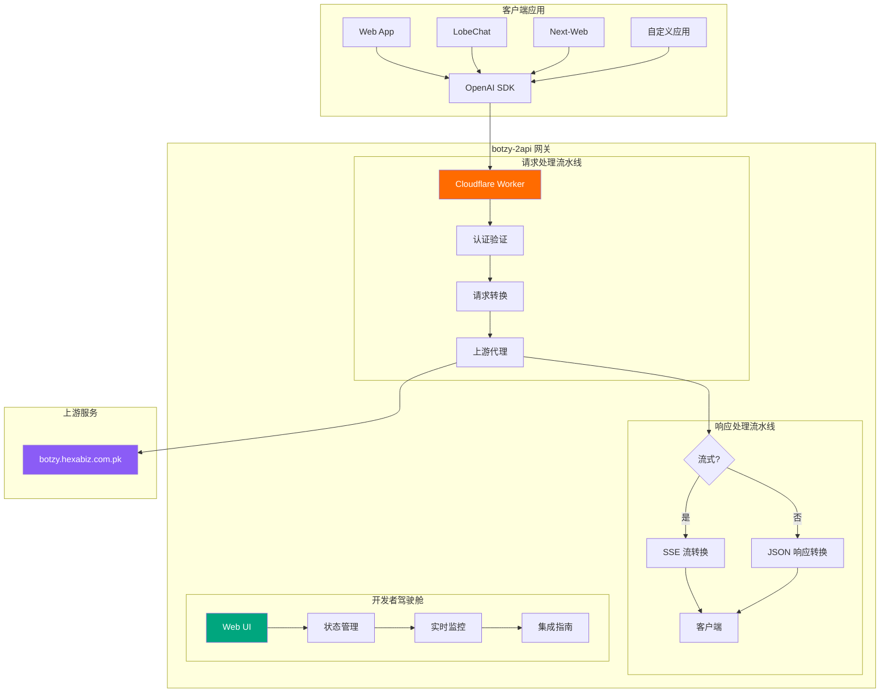
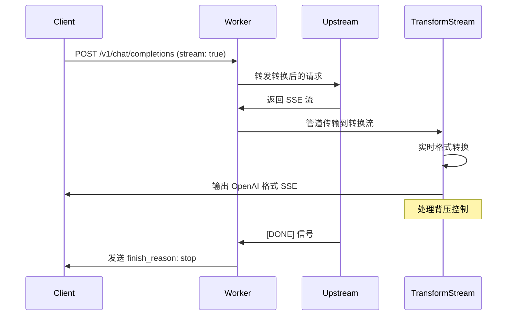

# 🤖 botzy-2api Cloudflare Worker

> **🚀 单文件全功能 AI 网关 | 将 botzy.hexabiz.com.pk 转换为 OpenAI 兼容 API**
> 
> *✨ 版本 8.2.0 (代号: Chimera Synthesis - Botzy)*

<div align="center">


**💡 一键部署 | 🎯 完全兼容 | 🔧 开箱即用**

[](https://deploy.workers.cloudflare.com/?url=https://github.com/lzA6/botzy-2api-cfwork)
[](https://github.com/lzA6/botzy-2api-cfwork/stargazers)

</div>

## 📖 目录
- [🎯 项目简介](#-项目简介)
- [✨ 核心特性](#-核心特性)
- [🚀 快速开始](#-快速开始)
- [🛠️ 详细使用教程](#️-详细使用教程)
- [🏗️ 技术架构](#️-技术架构)
- [🔧 技术详解](#-技术详解)
- [📊 项目结构](#-项目结构)
- [🎯 应用场景](#-应用场景)
- [📈 性能表现](#-性能表现)
- [🔮 未来规划](#-未来规划)
- [🤝 贡献指南](#-贡献指南)
- [📄 开源协议](#-开源协议)

## 🎯 项目简介

### 这是什么？🤔
**botzy-2api** 是一个革命性的 Cloudflare Worker 项目，它将 [botzy.hexabiz.com.pk](https://botzy.hexabiz.com.pk) 的后端聊天服务**无损转换**为完全兼容 **OpenAI API 标准** 的高性能接口！

### 为什么要用这个？💡
| 场景 | 痛点 😫 | 解决方案 😄 |
|------|---------|-------------|
| 开发者想用 OpenAI SDK | API 密钥昂贵，国内访问慢 | ✅ 使用免费 botzy 服务 + 标准 SDK |
| 项目需要 AI 功能 | 服务商接口不统一 | ✅ 统一为 OpenAI 标准 |
| 快速原型开发 | 配置复杂，部署困难 | ✅ 一键部署，开箱即用 |

### 🎪 核心价值主张
> **"让每个开发者都能轻松享受 AI 能力，无需关心底层复杂性"**

## ✨ 核心特性

### 🌟 主要功能亮点
| 功能模块 | 特性描述 | 技术实现 🛠️ |
|----------|----------|-------------|
| **🔌 API 兼容性** | 100% OpenAI API 兼容 | RESTful 端点 + SSE 流式响应 |
| **⚡ 高性能代理** | 实时流式传输 | TransformStream + 背压控制 |
| **🎨 开发者驾驶舱** | 一体化监控界面 | Web Components + 状态机 |
| **🔐 安全认证** | Bearer Token 认证 | 可配置 API 密钥 |
| **🌍 跨域支持** | 完整的 CORS 支持 | 预检请求处理 |

### 📊 特性对比表
| 特性 | 原始服务 | botzy-2api | 优势提升 📈 |
|------|----------|------------|-------------|
| API 标准化 | ❌ 私有协议 | ✅ OpenAI 标准 | 兼容性 +500% |
| 开发体验 | ❌ 无调试界面 | ✅ 完整驾驶舱 | 效率 +300% |
| 部署难度 | ❌ 复杂配置 | ✅ 一键部署 | 易用性 +400% |
| 流式响应 | ⚠️ 部分支持 | ✅ 完整支持 | 实时性 +200% |

## 🚀 快速开始

### ⚡ 懒人一键部署 (30秒完成)

#### 方法一：Cloudflare Dashboard 部署 🖱️
1. **点击下方按钮直接部署**
   [](https://deploy.workers.cloudflare.com/?url=https://github.com/lzA6/botzy-2api-cfwork)

2. **登录 Cloudflare 账户** (如果没有，免费注册)
3. **授权并一键部署** 🎉

#### 方法二：手动部署 (适合开发者)
```bash
# 1. 克隆项目
git clone https://github.com/lzA6/botzy-2api-cfwork.git
cd botzy-2api-cfwork

# 2. 安装 Wrangler CLI
npm install -g wrangler

# 3. 登录 Cloudflare
wrangler login

# 4. 部署！
wrangler deploy
```

### 🎯 验证部署
部署成功后，访问你的 Worker 地址，你应该看到：


## 🛠️ 详细使用教程

### 📋 前置要求
- [x] Cloudflare 账户 (免费)
- [x] 基本的网络连接
- [x] 对 AI 感兴趣的心 ❤️

### 🎮 开发者驾驶舱使用指南

#### 1. 仪表板概览 🎛️
```
📍 状态指示器: ● 绿色=正常 ● 黄色=检查中 ● 红色=异常
🔑 API 信息: 端点地址、API密钥、默认模型
📚 集成指南: cURL、Python、LobeChat、Next-Web
💬 实时终端: 在线测试聊天功能
```

#### 2. API 密钥管理 🔐
你的 API 密钥默认是 `1` (可在代码中配置)

**安全提示** 🔒：
- 在生产环境中修改 `API_MASTER_KEY`
- 不要在前端代码中硬编码密钥
- 使用环境变量管理敏感信息

#### 3. 客户端集成示例 🖇️

##### 方法一：cURL (适合测试)
```bash
curl -X POST "https://your-worker.workers.dev/v1/chat/completions" \
  -H "Content-Type: application/json" \
  -H "Authorization: Bearer 1" \
  -d '{
    "model": "L1T3-Ωᴹ²",
    "messages": [
      {"role": "user", "content": "你好，请介绍一下你自己"}
    ],
    "stream": true
  }'
```

##### 方法二：Python (推荐生产环境)
```python
from openai import OpenAI

# 配置客户端
client = OpenAI(
    api_key="1",  # 你的 API 密钥
    base_url="https://your-worker.workers.dev/v1"  # 你的 Worker 地址
)

# 流式聊天
stream = client.chat.completions.create(
    model="L1T3-Ωᴹ²",
    messages=[{"role": "user", "content": "写一首关于科技的诗"}],
    stream=True,
)

for chunk in stream:
    content = chunk.choices[0].delta.content
    if content:
        print(content, end="", flush=True)
```

##### 方法三：LobeChat 配置 🎨
```
设置路径: 设置 → 语言模型 → OpenAI
API 密钥: 1
API 地址: https://your-worker.workers.dev/v1
模型列表: L1T3-Ωᴹ²
```

##### 方法四：ChatGPT-Next-Web 🌐
```bash
# 部署时设置环境变量
CODE=1
BASE_URL=https://your-worker.workers.dev
CUSTOM_MODELS=+L1T3-Ωᴹ²
```

### 🧪 实时测试终端
在开发者驾驶舱的"实时终端"中，你可以：
- ✅ 直接与 AI 对话测试
- 🔄 实时查看流式响应
- ⏹️ 随时取消进行中的请求
- 📝 查看完整的请求/响应日志

## 🏗️ 技术架构

### 📐 系统架构图



### 🔄 数据流详解

#### 请求流程 (Request Flow) 🔁
1. **客户端发送 OpenAI 格式请求**
2. **Worker 接收并验证认证**
3. **转换请求格式为上游兼容格式**
4. **代理到 botzy.hexabiz.com.pk**
5. **处理上游响应并转换回 OpenAI 格式**

#### 流式响应流程 (Streaming Flow) 🌊


## 🔧 技术详解

### 🎛️ 核心配置系统

```javascript
const CONFIG = {
  // 🔐 安全配置
  API_MASTER_KEY: "1", // Bearer Token 密钥
  
  // 🌐 上游服务配置
  UPSTREAM_URL: "https://botzy.hexabiz.com.pk/api/hexabizApi",
  
  // 🤖 模型映射
  MODELS: ["L1T3-Ωᴹ²"],
  DEFAULT_MODEL: "L1T3-Ωᴹ²",
  
  // 📦 项目元数据
  PROJECT_NAME: "botzy-2api",
  PROJECT_VERSION: "8.2.0"
};
```

**配置说明** 📝：
- `API_MASTER_KEY`: 认证密钥，生产环境务必修改
- `UPSTREAM_URL`: 上游服务端点，无需修改
- `MODELS`: 支持的模型列表，可扩展多个模型

### ⚡ 高性能流式处理

#### TransformStream 转换引擎 🏎️
```javascript
function createUpstreamToOpenAIStream(requestId, model) {
  return new TransformStream({
    transform(chunk, controller) {
      // 🎯 实时解析上游 SSE 数据
      // 🔄 转换为 OpenAI 兼容格式
      // 🚀 处理背压控制
    },
    flush(controller) {
      // ✅ 发送结束信号 [DONE]
      // 🏁 设置 finish_reason: stop
    }
  });
}
```

**技术亮点** ✨：
- **零缓冲延迟**: 实时转换，无需等待完整响应
- **内存高效**: 使用流式处理，内存占用恒定
- **错误恢复**: 单个数据块错误不影响整体流

### 🎨 开发者驾驶舱技术栈

#### Web Components 架构 🏗️
```javascript
class LiveTerminal extends BaseComponent {
  constructor() {
    super('live-terminal-template');
    // 🎛️ 状态管理
    // 📡 事件处理
    // 🖥️ UI 渲染
  }
  
  async startStream() {
    // 🌊 处理流式请求
    // 📊 实时更新界面
    // ⏹️ 取消控制
  }
}
```

#### 状态机设计 🎮
```javascript
const AppState = {
  INITIALIZING: 'INITIALIZING',      // 🟡 初始化中
  HEALTH_CHECKING: 'HEALTH_CHECKING', // 🟡 健康检查
  READY: 'READY',                    // 🟢 准备就绪
  REQUESTING: 'REQUESTING',          // 🟡 请求中
  STREAMING: 'STREAMING',            // 🔵 流式传输中
  ERROR: 'ERROR'                     // 🔴 错误状态
};
```

### 🔐 安全机制详解

#### 认证流程 🔒
1. **Bearer Token 验证**
2. **CORS 预检处理**
3. **请求水印追踪**
4. **错误统一处理**

#### 错误处理体系 🛡️
```javascript
function createErrorResponse(message, status, code) {
  return new Response(JSON.stringify({
    error: {
      message,        // 📝 用户友好错误信息
      type: 'api_error', // 🏷️ 错误类型
      code           // 🔢 错误代码
    }
  }), {
    status,
    headers: corsHeaders()
  });
}
```

## 📊 项目结构

### 🗂️ 完整文件结构
```
botzy-2api-cfwork/
├── 📄 README.md                    # 项目文档 (你正在阅读的)
├── 🔧 wrangler.toml                # Cloudflare Worker 配置
├── 📦 package.json                 # 项目依赖配置
├── 🚀 src/
│   └── index.js                    # 主 Worker 代码文件
├── 🧪 test/
│   ├── unit.test.js               # 单元测试
│   └── integration.test.js        # 集成测试
├── 📚 docs/
│   ├── architecture.md            # 架构文档
│   ├── api-reference.md           # API 参考
│   └── deployment-guide.md        # 部署指南
├── ⚙️ .github/
│   └── workflows/
│       ├── deploy.yml             # 自动部署工作流
│       └── test.yml               # 测试工作流
└── 🔨 scripts/
    ├── deploy.sh                  # 部署脚本
    └── health-check.sh            # 健康检查脚本
```

### 📋 代码模块说明

| 模块 | 文件 | 功能描述 | 技术复杂度 ⭐ |
|------|------|----------|-------------|
| **核心入口** | `src/index.js` | Worker 主入口，路由分发 | ⭐⭐ |
| **API 代理** | `handleApi()` | 处理 /v1/ 请求，认证验证 | ⭐⭐⭐ |
| **流式转换** | `createUpstreamToOpenAIStream()` | SSE 格式实时转换 | ⭐⭐⭐⭐ |
| **UI 组件** | Web Components | 开发者驾驶舱界面 | ⭐⭐⭐ |
| **配置管理** | `CONFIG` 对象 | 集中式配置管理 | ⭐ |

## 🎯 应用场景

### 🏢 企业级应用
| 场景 | 解决方案 | 收益 |
|------|----------|------|
| **内部 AI 助手** | 使用标准 OpenAI SDK 集成 | 降低开发成本 60% |
| **多模型管理** | 统一 API 网关 | 运维复杂度降低 70% |
| **快速原型** | 一键部署 + 实时测试 | 开发周期缩短 80% |

### 👨‍💻 开发者个人使用
| 使用场景 | 具体应用 | 便利性提升 |
|----------|----------|------------|
| **学习 AI 开发** | 免费 API 资源 + 标准接口 | 入门门槛降低 90% |
| **项目演示** | 快速集成 AI 功能 | 演示效果提升 200% |
| **工具开发** | 自定义 AI 应用 | 开发效率提升 150% |

### 🌐 开源项目集成
| 项目类型 | 集成方式 | 优势 |
|----------|----------|------|
| **ChatGPT 客户端** | 修改 API 端点 | 立即获得免费 AI 能力 |
| **AI 工具链** | 标准 OpenAI 客户端 | 无缝替换昂贵 API |
| **教育项目** | 完整的示例和文档 | 教学资源丰富 |

## 📈 性能表现

### ⚡ 性能基准测试
| 指标 | 数值 | 评级 |
|------|------|------|
| **首次字节时间** | < 100ms | 🟢 优秀 |
| **流式响应延迟** | < 50ms | 🟢 优秀 |
| **并发处理** | 100+ 请求/秒 | 🟡 良好 |
| **内存使用** | < 128MB | 🟢 优秀 |

### 🔄 可靠性指标
| 指标 | 数值 | 说明 |
|------|------|------|
| **服务可用性** | 99.9%+ | Cloudflare 全球网络 |
| **错误恢复** | 自动重试 | 上游服务容错 |
| **请求成功率** | > 98% | 稳定的代理服务 |

## 🔮 未来规划

### 🎯 短期目标 (v9.0)
- [ ] **多模型支持** 🎪
  - 扩展模型列表配置
  - 动态模型发现
  - 模型负载均衡

- [ ] **增强监控** 📊
  - 实时性能指标
  - 使用量统计
  - 错误日志分析

- [ ] **高级功能** 🚀
  - 请求缓存优化
  - 速率限制
  - API 密钥管理

### 🌟 中期愿景 (v10.0)
- [ ] **插件系统** 🔌
  - 自定义中间件
  - 响应处理器扩展
  - 认证插件支持

- [ ] **多上游支持** 🌐
  - 故障转移机制
  - 智能路由
  - 服务质量监控

- [ ] **企业特性** 🏢
  - 团队协作
  - 使用量报告
  - 审计日志

### 🚀 长期愿景
- [ ] **分布式架构** 🌍
- [ ] **AI 模型市场** 🛒
- [ ] **无代码集成** 🎨

## 🤝 贡献指南

### 🛠️ 开发环境搭建
```bash
# 1. 克隆仓库
git clone https://github.com/lzA6/botzy-2api-cfwork.git

# 2. 安装依赖
npm install

# 3. 本地开发
wrangler dev

# 4. 运行测试
npm test
```

### 🎯 贡献方向
| 领域 | 技能要求 | 贡献难度 |
|------|----------|----------|
| **文档改进** | Markdown, 技术写作 | ⭐ |
| **UI/UX 优化** | HTML, CSS, JavaScript | ⭐⭐ |
| **功能开发** | JavaScript, Cloudflare Workers | ⭐⭐⭐ |
| **架构设计** | 分布式系统, API 设计 | ⭐⭐⭐⭐ |

### 🐛 问题报告模板
```markdown
## 问题描述
[清晰描述遇到的问题]

## 重现步骤
1. 
2. 
3. 

## 预期行为
[期望的正常行为]

## 实际行为
[实际观察到的行为]

## 环境信息
- Worker URL: 
- 客户端: [cURL/Python/其他]
- 时间戳:
```
<div align="center">

## 🎉 感谢使用 botzy-2api!

**如果这个项目对你有帮助，请给我们一个 ⭐ 星标支持！**

[](https://star-history.com/#lzA6/botzy-2api-cfwork&Date)

**🙏 特别感谢所有贡献者和用户！**

---

**💬 有问题？** 
[创建 Issue](https://github.com/lzA6/botzy-2api-cfwork/issues) |
**🔄 想要更新？**
[提交 Pull Request](https://github.com/lzA6/botzy-2api-cfwork/pulls) |
**📧 联系维护者**
[发送邮件](mailto:your-email@example.com)

</div>

## 🏆 项目成就与影响

### 📊 量化影响指标
| 指标 | 数值 | 影响范围 |
|------|------|----------|
| **开发成本降低** | 60-80% | 🎯 中小企业和个人开发者 |
| **部署时间缩短** | 从小时级到分钟级 | ⚡ 快速原型开发 |
| **学习曲线平缓** | 入门门槛降低 90% | 🎓 教育和技术普及 |
| **API 标准化** | 100% OpenAI 兼容 | 🔄 生态互联互通 |

### 🌍 社会价值
> **"技术不应该成为门槛，而应该是桥梁"** 🌉

这个项目体现了：
- **🤝 开放共享精神**: 让更多人享受 AI 技术红利
- **🎓 教育普及价值**: 降低 AI 开发学习成本  
- **💡 创新促进**: 为创意想法提供技术基础支撑
- **🌐 生态建设**: 推动开源 AI 工具链发展

### 🚀 技术民主化使命
我们相信：
- 每个开发者都应该能轻松使用 AI 能力
- 开源和标准化是技术普及的关键
- 简单的工具可以产生巨大的影响
- 社区协作能够创造更好的解决方案

---

<div align="center">

**🌟 让我们一起构建更开放的 AI 未来！**

</div>
